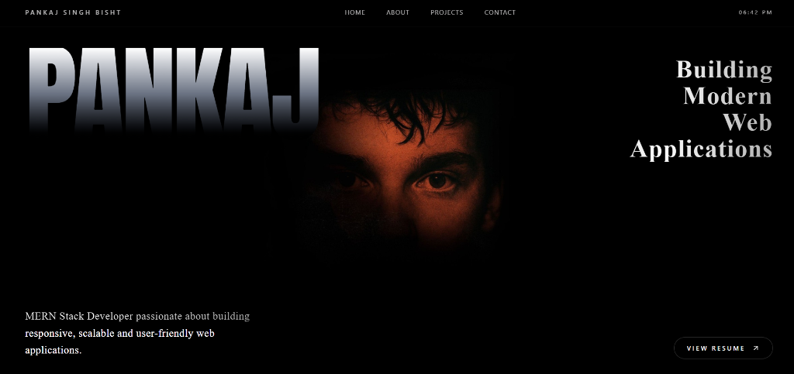
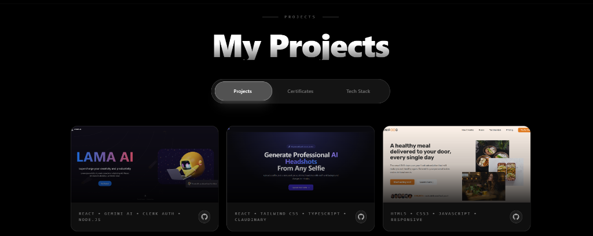
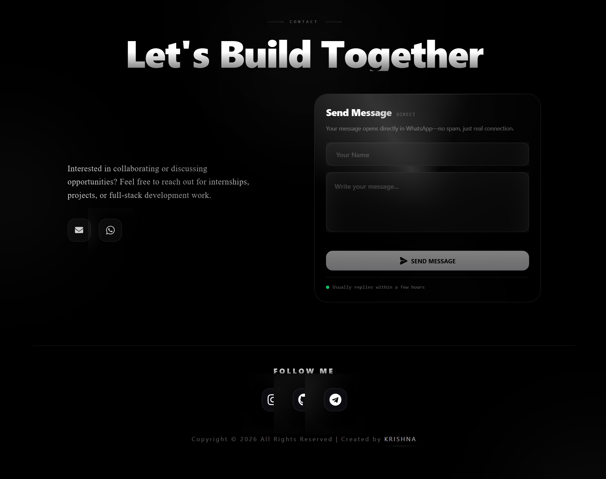

# Pankaj Singh Bisht Portfolio

A modern and interactive personal portfolio website showcasing my projects, skills, and experience as a Full Stack MERN Developer.

## 🚀 Live Demo

https://personal-portfolio-swart-ten-20.vercel.app/

## 📌 Features

- Modern dark UI
- Responsive design
- Smooth animations with Framer Motion
- About Me section
- Projects showcase
- Skills section
- Contact form (WhatsApp integration)
- Resume download
- Social media links

## 🛠️ Tech Stack

- React.js
- TypeScript
- Vite
- Tailwind CSS
- Framer Motion
- React Router

## 📂 Folder Structure

```
src/
 ├── assets/
 ├── components/
 ├── pages/
 ├── App.tsx
 ├── main.tsx
 └── styles.css
```

## Screenshots

### Home



### Projects



### Contact




##  Author

**Pankaj Singh Bisht**

---

⭐ If you like this project, don't forget to star the repository.
