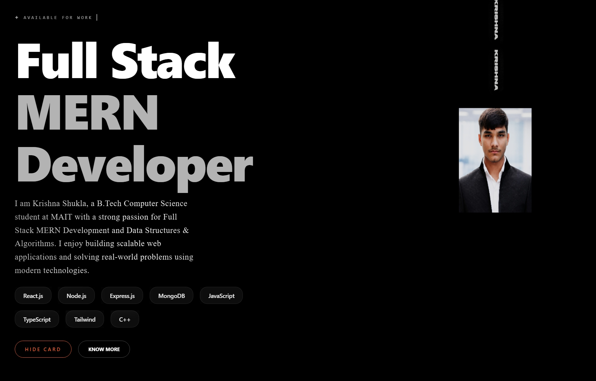

# Krishna Shukla Portfolio

A modern and interactive personal portfolio website showcasing my projects, skills, and experience as a Full Stack MERN Developer.

## 🚀 Live Demo

https://portfolio-eight-taupe-95.vercel.app/

## 📌 Features

- Modern dark UI
- Responsive design
- Smooth animations with Framer Motion
- Interactive 3D ID Card
- About Me section
- Projects showcase
- Skills section
- Contact form
- Resume download
- Social media links

## 🛠️ Tech Stack

- React.js
- TypeScript
- Vite
- Tailwind CSS
- Three.js
- React Three Fiber
- Framer Motion
- React Router
- EmailJS

## 📂 Folder Structure

```
src/
 ├── components/
 ├── sections/
 ├── assets/
 ├── App.tsx
 └── main.tsx
```

## Screenshots

### Home


### About



### Projects


### Contact


##  Author

**Krishna Shukla**

---

⭐ If you like this project, don't forget to star the repository.
